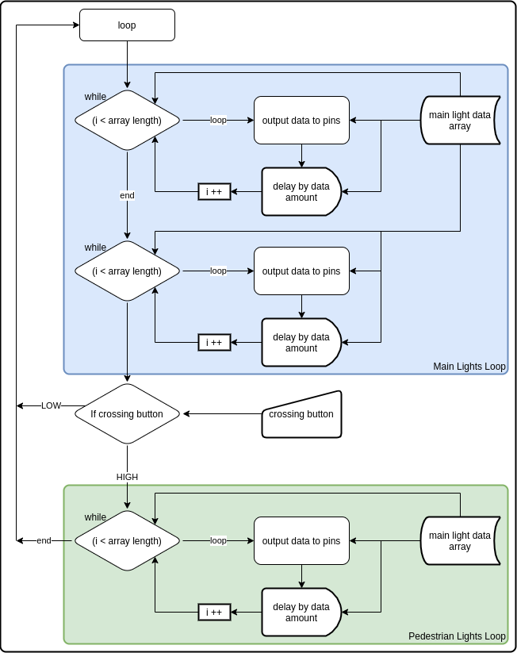

# CI514 Learning Journal

## Charlotte (Lily) Ward 2021-2022 CSG

### Task 1

Initialising the code with the Arduino IDE involves utilising the example project "Blink". This is a simple and fully public domain C script that implements a blink using some very simple logic. It is as follows:

```c
// the setup function runs once when you press reset or power the board
void setup() {
  // initialize digital pin LED_BUILTIN as an output.
  pinMode(LED_BUILTIN, OUTPUT);
}

// the loop function runs over and over again forever
void loop() {
  digitalWrite(LED_BUILTIN, HIGH);   // turn the LED on (HIGH is the voltage level)
  delay(1000);                       // wait for a second
  digitalWrite(LED_BUILTIN, LOW);    // turn the LED off by making the voltage LOW
  delay(1000);                       // wait for a second
}
```

This code initialises an internal pin for the built-in LED, then the firmware for the device calls `loop()` on repeat, with the `delay()` function serving as the frequency of the loop. Consider this as a `while true` loop, without needing the extra syntax. This code sends high voltage to the LED, waits a second, sends low voltage to the LED, waits, then restarts the cycle.


### Task 2

For my purposes, this code should be rewritten to initialise 3 pins using the following circuit diagram:


According to the official documentation (REF1), setting the digital pins used in the circuit involves calling the function `pinMode(num, OUTPUT)`. The `num` word here refers to the value of the pin, so in this case it would be:

```c
pinMode(13, OUTPUT);
pinMode(12, OUTPUT);
pinMode(11, OUTPUT);
```

Following this, the loop must have 4 states, with delays in between. For testing, I'm going to set this to 250ms per delay, although a proper implementation of this system would likely use some kind of signal from sensors, or more finely-tuned timing from programmed ROM.

The following truth table shows the 4 states, with the name of the state, and a colour code for each LED.

| 13 (Green) | 12 (Amber) | 11 (Red) | State           |
| :--------- | :--------- | :------- | :-------------- |
| HIGH       | LOW        | LOW      | Go              |
| LOW        | HIGH       | LOW      | Prepare to stop |
| LOW        | LOW        | HIGH     | Stop            |
| LOW        | HIGH       | HIGH     | Prepare to go   |

Using this, it's possible to derive the optimal timing for each `digitalWrite()` function.

| 13 (Green) | 12 (Amber) | 11 (Red) |
| :--------- | :--------- | :------- |
| HIGH       | LOW        | LOW      |
| LOW        | HIGH       | -        |
| -          | LOW        | HIGH     |
| -          | HIGH       | -        |

```c
delay(250); // State 0
digitalWrite(13, HIGH);
digitalWrite(12, LOW);
digitalWrite(11, LOW);

delay(250); // State 1
digitalWrite(13,LOW);
digitalWrite(12, HIGH);
// 11 unchanged

delay(250); // State 2
// 13 unchanged
digitalWrite(12, LOW);
digitalWrite(11, HIGH);

delay(250); // State 3
// 13 unchanged
digitalWrite(12, HIGH);
// 11 unchanged
```

This is a basic implementation of the traffic light system, although it doesn't use any abstractions like functions to make the system more intelligent. Regardless, it's a functional test implementation. Setting up the serial port on Linux was a chore, as it seems like the kernel doesn't recognise a port unless it's been plugged in from boot. Regardless, I got the code flashed, and it works perfectly.


and repeat.

According to the brief, this code should be modified to have extra abstraction, using a function to control each of the traffic lights. My approach to this normally would involve using a class for each set of lights, with a method for changing state, using a tuple for the various states. This is impossible in C, however, as C has no classes or tuples (short of fancy implementations). In it's place, I will be using a switch/case function with a simple integer to control the state.

```c
// the setup function runs once when you press reset or power the board
void setup() {
  // initialize digital pin LED_BUILTIN as an output.
  pinMode(13, OUTPUT);
  pinMode(12, OUTPUT);
  pinMode(11, OUTPUT);
  pinMode(10, OUTPUT);
  pinMode(9,  OUTPUT);
  pinMode(8,  OUTPUT);
}

void trafficLights(int green, int amber, int red, int state) {
  switch (state) {
    case 0:
      // State 0
      digitalWrite(green, HIGH);
      digitalWrite(amber, LOW);
      digitalWrite(red,   LOW);
      break;
    case 1:
      digitalWrite(green,LOW);
      digitalWrite(amber, HIGH);
      // red unchanged
      break;
    case 2:
      // green unchanged
      digitalWrite(amber, LOW);
      digitalWrite(red, HIGH);
      break;
    case 3:
      // green unchanged
      digitalWrite(amber, HIGH);
      // red unchanged
      break;
    default:
      break;
  }
}

// the loop function runs over and over again forever
void loop() {
  for (int i = 0; i < 4; i++) {
    trafficLights(13,12,11,i);
    trafficLights(10,9,8,(i+2)%4);
    delay(500);
  }
}
```

This code is functional, having the 2nd set of traffic lights offset from the 1st by exactly half a cycle. The IDE didn't provide any snippets for switch/case or for like I'm used to with Visual Studio Code, however I managed to get the syntax right the first time around. This code works by looping over 4 values, 0 through 3, and having a delay between each value. The modulo function serves to offset the 2nd pair of traffic lights by 2 values, with a modulo to keep it within the range. The following flowchart describes how this code operates:


There is a major bug with this program, having only 4 states, with two of the intermediary states (1 and 3) allowing the Amber lights to be on for both lights at once. This is a safety hazard, as cars will potentially interpret this as a signal that they can go, increasing the risk of collisions. On top of this, real-world traffic light systems do not allow this state configuration due to safety. Below is another truth table, with the illegal state highlighted with ⚠️.

| 13 (Green) | 12 (Amber) | 11 (Red) | 10 (Green) | 9 (Amber) | 8 (Red) |
| :--------- | :--------- | :------- | :--------- | :-------- | :------ |
| HIGH       | LOW        | LOW      | -          | LOW       | HIGH    |
| LOW        | ⚠️HIGH      | -        | -          | ⚠️HIGH     | -       |
| -          | LOW        | HIGH     | HIGH       | LOW       | LOW     |
| -          | ⚠️HIGH      | -        | LOW        | ⚠️HIGH     | -       |

To remedy this issue, some extra states must be added, accounting for this potential configuration:

| 13 (Green) | 12 (Amber) | 11 (Red) | 10 (Green) | 9 (Amber) | 8 (Red) |
| :--------- | :--------- | :------- | :--------- | :-------- | :------ |
| HIGH       | LOW        | LOW      | LOW        | LOW       | HIGH    |
| LOW        | HIGH       | LOW      | LOW        | LOW       | HIGH    |
| LOW        | LOW        | HIGH     | LOW        | HIGH      | HIGH    |
| LOW        | LOW        | HIGH     | HIGH       | LOW       | LOW     |
| LOW        | LOW        | HIGH     | LOW        | HIGH      | LOW     |
| LOW        | HIGH       | HIGH     | LOW        | LOW       | HIGH    |

Only illustrating the deltas goes as follows:

| 13 (Green) | 12 (Amber) | 11 (Red) | 10 (Green) | 9 (Amber) | 8 (Red) |
| :--------- | :--------- | :------- | :--------- | :-------- | :------ |
| HIGH       | LOW        | LOW      | -          | -         | -       |
| LOW        | HIGH       | -        | -          | -         | -       |
| -          | LOW        | HIGH     | -          | HIGH      | -       |
| -          | -          | -        | HIGH       | LOW       | LOW     |
| -          | -          | -        | LOW        | HIGH      | -       |
| -          | HIGH       | -        | -          | LOW       | HIGH    |

This fixes the bug whereby two amber lights can appear at once, and is a simple fix involving only changing a few characters. This change is represented below in this patch diff.

```patch
@@ -27,7 +27,7 @@ void trafficLights(int green, int amber, int red, int state) {
       digitalWrite(amber, LOW);
       digitalWrite(red, HIGH);
       break;
-    case 3:
+    case 5:
       // green unchanged
       digitalWrite(amber, HIGH);
       // red unchanged
@@ -39,9 +39,9 @@ void trafficLights(int green, int amber, int red, int state) {

 // the loop function runs over and over again forever
 void loop() {
-  for (int i = 0; i < 4; i++) {
+  for (int i = 0; i < 6; i++) {
     trafficLights(13,12,11,i);
-    trafficLights(10,9,8,(i+2)%4);
+    trafficLights(10,9,8,(i+3)%6);
     delay(500);
   }
 }
```

##### II.

My initial idea for implementing a pedestrian crossing involves extending the table to add in a value that you can add to offset the current iteration value to, performing a task of switching the lights to red smoothly, then allowing pedestrians, then switching the lights back to their normal loop. This quickly became far to complicated, with a table 2-3x bigger than the ones above. Additionally, it causes some buggy behaviour where orange lights flash on and then off, and the loop doesn't start up again cleanly.

| 13 (Green) | 12 (Amber) | 11 (Red) | 10 (Green) | 9 (Amber) | 8 (Red) | 7 (Ped Green) | 6 (Ped Red) |
| :--------- | :--------- | :------- | :--------- | :-------- | :------ | :------------ | :---------- |
| HIGH       | LOW        | LOW      | LOW        | LOW       | HIGH    | LOW           | HIGH        |
| LOW        | HIGH       | LOW      | LOW        | LOW       | HIGH    | LOW           | HIGH        |
| LOW        | LOW        | HIGH     | LOW        | HIGH      | HIGH    | LOW           | HIGH        |
| LOW        | LOW        | HIGH     | HIGH       | LOW       | LOW     | LOW           | HIGH        |
| LOW        | LOW        | HIGH     | LOW        | HIGH      | LOW     | LOW           | HIGH        |
| LOW        | HIGH       | HIGH     | LOW        | LOW       | HIGH    | LOW           | HIGH        |
|            |            |          |            |           |         |               |             |
| LOW        | LOW        | LOW      | LOW        | LOW       | HIGH    | LOW           | HIGH        |
| LOW        | HIGH       | LOW      | LOW        | LOW       | HIGH    | LOW           | HIGH        |
| LOW        | LOW        | HIGH     | LOW        | LOW       | HIGH    | LOW           | HIGH        |
| LOW        | LOW        | HIGH     | LOW        | LOW       | HIGH?   | LOW           | HIGH        |
| LOW        | LOW        | HIGH     | LOW        | HIGH      | LOW     | LOW           | HIGH        |
| LOW        | LOW        | HIGH     | LOW        | LOW       | HIGH    | HIGH          | LOW         |

An example of the buggy behaviour:


This solution is growing to be far too complex, and isn't very scalable: adding extra branches or crossings will require extra states, which can quickly get out of hand. Instead, I need to come up with a solution that is much easier to simplify and abstract. Below is a flowchart of the solution that I want to utilise



Following this, I programmed the following using some loops. Currently, the pins are hardcoded, which is a downside when compared with the original implementation, but it's more functional as it has better animations and better support for the different loops.

```c
// GREEN, AMBER, RED, WAIT
int mainTable[5][4] = {
  {0,0,1, 500},
  {0,1,1, 500},
  {1,0,0, 1000},
  {0,1,0, 500},
  {0,0,1, 500}
};
// GREEN, RED, WAIT
int pedestrianTable[9][3] = {
  {0,1, 200},
  {1,0, 2000},
  {0,0, 500},
  {1,0, 500},
  {0,0, 500},
  {1,0, 500},
  {0,0, 500},
  {1,0, 500},
  {0,1, 200}
};

void loop() {
  for (int i=0; i < sizeof mainTable / sizeof *mainTable; i++) {
    digitalWrite(13, mainTable[i][0]);
    digitalWrite(12, mainTable[i][1]);
    digitalWrite(11, mainTable[i][2]);
    delay(mainTable[i][3]);
  }
  for (int i=0; i < sizeof mainTable / sizeof *mainTable; i++) {
    digitalWrite(10, mainTable[i][0]);
    digitalWrite(9, mainTable[i][1]);
    digitalWrite(8, mainTable[i][2]);
    delay(mainTable[i][3]);
  }

  if (digitalRead(5)) {
    for (int i=0; i < sizeof pedestrianTable / sizeof *pedestrianTable; i++) {
      digitalWrite(7, pedestrianTable[i][0]);
      digitalWrite(6, pedestrianTable[i][1]);
      delay(pedestrianTable[i][2]);
    }
  }
}
```

This code is more practical, looping through the data for each traffic light, then branching if there's a pedestrian pressing the button. This does require the pedestrian to hold the button for the lights to change, which is a minor bug and can be fixed with a slight patch.

```patch
@@ -31,6 +31,7 @@ int pedestrianTable[9][3] = {
     {0, 0, 500},
     {1, 0, 500},
     {0, 1, 200}};
+bool pedestrianWaiting = false;

 void loop()
 {
@@ -40,6 +41,10 @@ void loop()
     digitalWrite(12, mainTable[i][1]);
     digitalWrite(11, mainTable[i][2]);
     delay(mainTable[i][3]);
+    if (digitalRead(5))
+    {
+      pedestrianWaiting = true;
+    }
   }
   for (int i = 0; i < sizeof mainTable / sizeof *mainTable; i++)
   {
@@ -47,15 +52,20 @@ void loop()
     digitalWrite(9, mainTable[i][1]);
     digitalWrite(8, mainTable[i][2]);
     delay(mainTable[i][3]);
+    if (digitalRead(5))
+    {
+      pedestrianWaiting = true;
+    }
   }

-  if (digitalRead(5))
+  if (pedestrianWaiting)
   {
     for (int i = 0; i < sizeof pedestrianTable / sizeof *pedestrianTable; i++)
     {
       digitalWrite(7, pedestrianTable[i][0]);
       digitalWrite(6, pedestrianTable[i][1]);
       delay(pedestrianTable[i][2]);
+      pedestrianWaiting = false;
     }
   }
 }
```

This adds a boolean that's checked each loop sample, which is an imperfect solution, but helps to remedy the issue of needing to hold the button. A full implementation would involve utilising an asynchronous function, toggling the boolean whenever the button is pressed.

Additionally, the hardcoded pins and dual loop could be improved. The following flowchart uses an integer for the amount of crossings included.


Using this flowchart, implementing the following is possible:

```patch
@@ -32,29 +32,22 @@ int pedestrianTable[9][3] = {
     {1, 0, 500},
     {0, 1, 200}};
 bool pedestrianWaiting = false;
+int crossingCount = 2;

 void loop()
 {
-  for (int i = 0; i < sizeof mainTable / sizeof *mainTable; i++)
+  for (int j = 0; j < crossingCount; j++)
   {
-    digitalWrite(13, mainTable[i][0]);
-    digitalWrite(12, mainTable[i][1]);
-    digitalWrite(11, mainTable[i][2]);
-    delay(mainTable[i][3]);
-    if (digitalRead(5))
+    for (int i = 0; i < sizeof mainTable / sizeof *mainTable; i++)
     {
-      pedestrianWaiting = true;
-    }
-  }
-  for (int i = 0; i < sizeof mainTable / sizeof *mainTable; i++)
-  {
-    digitalWrite(10, mainTable[i][0]);
-    digitalWrite(9, mainTable[i][1]);
-    digitalWrite(8, mainTable[i][2]);
-    delay(mainTable[i][3]);
-    if (digitalRead(5))
-    {
-      pedestrianWaiting = true;
+      digitalWrite(13 - (j * 3), mainTable[i][0]);
+      digitalWrite(12 - (j * 3), mainTable[i][1]);
+      digitalWrite(11 - (j * 3), mainTable[i][2]);
+      delay(mainTable[i][3]);
+      if (digitalRead(5))
+      {
+        pedestrianWaiting = true;
+      }
     }
   }
```

This subtracts an offset from the highest pin value, descending down in multiples of 3, starting at 13. For this implementation there are only 6 utilised pins for the main lights, and 2 for the pedestrian crossings, but further implementations would expand the pin space for the amount of crossings required in Part 2.

The pins are currently somewhat hardcoded in this implementation, and could be assigned more programmatically by adding a count for the amount of different lights required; pedestrian crossings only require 2 pins, as you can have many LEDs to those two pins, whereas each road direction needs 3 pins for each 3 lights (although it's possible to branch these out into multiple lights pointing in the same direction).

This would involve an implementation of something similar to the greedy algorithm, requiring the 3n values to be subtracted as long as they're needed, then 2m. An algebraic implementation of this is as follows;

**3*n* + 2*m* < 13**

Where *n* is the count of roads, and *m* is the count of pedestrian crossings.

Additionally, this could be improved with further circuitry in the form of an I/O Expander or something to decode binary. I believe this implementation, along with the asynchronous button read, to be out of scope for this project, due to the additional complexity of adding them. Further development would be spent on this avenue, however.

### Task 3

This task involves pushing 50 random values between 0 and 255 to an array, then sorting them in ascending or descending order. This involves implementing two different sorting algorithms of my choice, and outputting the sorted array to the serial monitor. On top of this, I'm going to see if I can do some performance metrics with the serial monitor.

There are 8 L.E.Ds that are required for this part, and I'm going to make them display the lowest value and highest value, as well as the current comparison (if applicable). I'm going to implement Bubble sort and Radix sort, as they differ in complexity; bubble sort has high time complexity and low space complexity, whereas radix sort is less temporally complex, but has higher space complexity. TODO REF4


TODO REF4

## References

TODO REF1 https://www.arduino.cc/reference/en/language/functions/digital-io/pinmode/

TODO REF2 https://www.tutorialspoint.com/cprogramming/c_arrays.htm

TODO REF3 https://flaviocopes.com/c-array-length/

TODO REF4 https://medium.com/@george.seif94/a-tour-of-the-top-5-sorting-algorithms-with-python-code-43ea9aa02889
