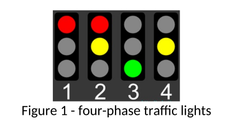

# CI541 Assignment 1 - Game Prototype

| Module Title                                   | Game Development Frameworks              |
| :--------------------------------------------- | :--------------------------------------- |
| Module Code                                    | CI514                                    |
| Author(s)/Marker(s) of Assignment              | Saeed Malekshahi                         |
| Assignment No                                  | 1                                        |
| Assignment Title                               | Learning Journal 1: Programming Embedded |
| Percentage contribution to module mark         | 50%                                      |
| Weighting of components within this assessment | Task 1 20%, Task 2 40%, Task 3 40%       |
| Module learning outcome(s) assessed:           | **LO2**                                  |
|                                                | **LO4**                                  |
| The assessment is marked anonymously           | No                                       |
| Assessment marking criteria/rubric             | See below                                |
| Date of issue                                  | 12.10.2021                               |
| **Deadline for submission**                    | **17.01.2022 by 15:00**                  |
| Method of submission                           | e-submission (online via MyStudies)      |
| Date feedback will be provided                 | 14.02.2022                               |

## Task 1: Familiarisation.
In this task, you are requested to familiarise yourself with the Arduino environment.

Requirements:

1. Obtain an Arduino Mega or Uno Board and connect it to the PC.
2. From the computing, programmes select Arduino program.
3. Activate the Arduino environment.
4. From the drop, menu select, the Arduino board type from the Tools drop-down menu. (The Board used is Arduino Mega)
5. From the same drop-down Menu select the COM port that communicates with the board.
6. From File drop menu choose the “Example” and choose the “Digital” and choose the programme “Blink”
7. Upload the program and go through the compilation process
8. Upload the program and run it on the Arduino Board.
9. You should see an LED Blinking on the Board.
10. You can also use a Breadboard and link it up with the board and use an LED to see it Flashing
11. Increase the number of lights to three and switch them serially. You need to modify the program to do this.

## Task 2: Traffic light Simulation using ‘C’ language

In this lab activity, you are requested to simulate a real traffic light environment using the procedural language ‘C’.
Take the following steps to implement the required task:

1. Obtain an Arduino Uno or Mega Board and connect it to the PC.
1. From the computing, programmes select Arduino program.
1. Using a graphical package, develop and draw a flowchart of a simple four-phase traffic light.

### Part 1

Create a programme in “C” to simulate the four-phase traffic light and test its functionality.

Write a function to control each of the traffic lights E.g. void TrafficLight1 (int red, int amber, int green);
I. Use the serial port to simulate the pedestrian pressing the button
II. Both sets of traffic lights should be red for pedestrians to cross safely.
III. The pedestrian green LED should flash as a warning that the main lights are about to start up
IV. The main lights should sequence to and from pedestrian crossing mode in a safe and tidy sequence.
V. The state of the lights should be written to the serial port:

E.g. L1 = ON, ON, OFF L2 = OFF, ON, OFF PED = ON, OFF means traffic light 1 is RED/AMBER, traffic light 2 is AMBER, a pedestrian crossing is RED

### Part 2

1. Modify the developed algorithm and produce a new flowchart to provide a solution for the operation of a junction with four ‘four-phase’ traffic lights.

2. Implement the modified algorithm and a program in “C” to show its operation.

### Part 3

1. Modify the flowchart for the Junction and provide a new flowchart which provides a pedestrian crossing by using two LED red and green for each junction on either side of the road.
2. Write a “C” program to implement the flowchart.

## Task 3

In this lab activity, you are requested to develop and apply two different sort algorithms to an array of fifty random numbers to sort them in ascending or descending order by writing a program using the procedural language ‘C’ to implement the algorithm. Comment on the efficiency of the algorithm used in terms of execution time.

Requirements:

1. Obtain an Arduino Uno or Mega Board and connect it to the PC.
2. From the computing, programmes select Arduino program.
3. Draw a flowchart of an algorithm which sorts the array in ascending or descending order. The numbers are in the range of 0 to 255.
4. The highest and the lowest numbers in the array should be displayed using eight L.E.Ds.
5. The sorted array should be displayed on the serial monitor using a pointer.
6. The sorting function should be triggered by keyboard input from the serial monitor.
7. The numbers should be randomly generated.

# Assessment Criteria

<!--Markdown will be the death of me.-->

|                                  | **Identify the basic elements in hardware development tools for embedded platforms. Lab tasks** | **Develop real-time application programs using a range of programming techniques and tools. Lab tasks**                     |
| :------------------------------- | :---------------------------------------------------------------------------------------------- | :-------------------------------------------------------------------------------------------------------------------------- |
| **Unsatisfactory (E/F 0-39%)**   | Little evidence of successful engagement                                                        | Few or no tasks completed successfully.  Little evidence of successful engagement                                           |
| **Adequate (D 40-49%)**          | Explanation incomplete and lacking detail                                                       | Few tasks completed successfully.  Little evidence of research                                                              |
| **Sound (C 50-59%)**             | Adequate explanation of the main elements of the supplied development tools                     | Most programming tasks attempted at least half completed successfully.  Some evidence of research                           |
| **Good (B 60-69%)**              | Clear explanations showing good depth of understanding of the supplied development tools        | All programming tasks attempted, most completed successfully with clear documentation.                                      |
| **Excellent (A 70-79%)**         | Clear and detailed explanation demonstrating some independent research                          | All programming tasks completed and documented to a good standard                                                           |
| **Outstanding (A+/A\* 80-100%)** | Exceptionally clear and detailed explanation addressing alternative development tools           | All programming tasks completed and documented to an exceptionally high standard demonstrating a high degree of originality |
