# 21-10-04 - Lecture 1

CI583 - Lecture run by James Burton <J.Burton@brighton.ac.uk>

## Description

This module is taught in 1 semester, and is divided into two parts; Data
Structures and Algorithms, then Operating Systems. These two are connected, as
operating systems rely on data structures and algorithms for their design.

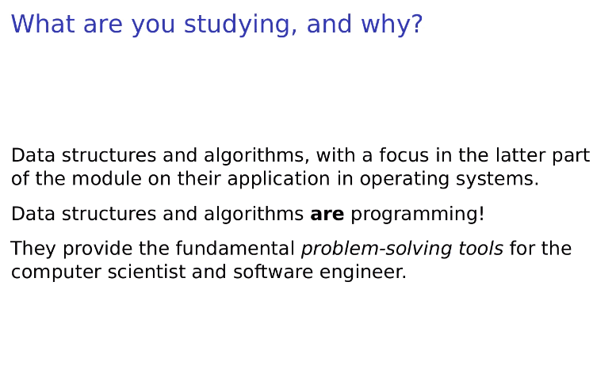

Extension of CI401 - data structures lead on directly from programming. THey are
fundamentally problem solving tools. CI553 (not taking) extends this with OOP.

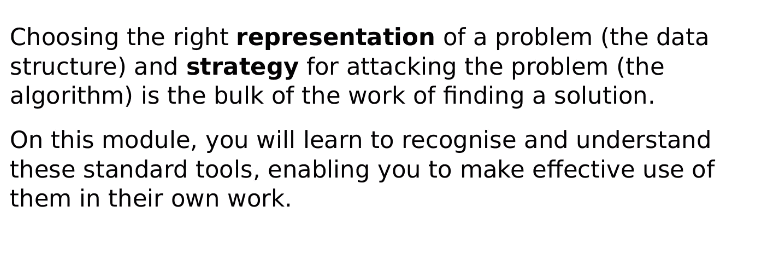

Choosing the right data structure and strategy for a problem is the bulk of the
work of a solution.

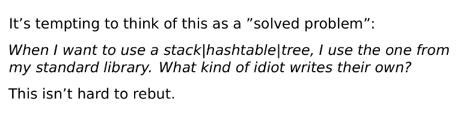

We will be writing our own data structures instead of using the standard
library, to learn the implementation of these. These things have already been
written, but they don't properly expose their inner workings.

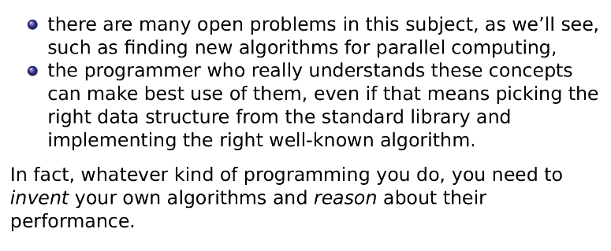

"I don't think that you truly understand the concept without writing it from
scratch" - *Burton*. Deep understanding comes from implementation and
development, rather than utilisation.

This implementation issue also helps to teach

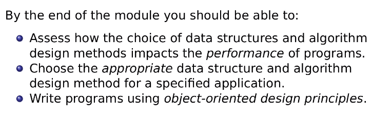

Learning outcomes:
- Assess how choices in data structures impacts performance.
- Choose appropriate data structures and algorithms when designing applications.
- Write programs using object-oriented design principles.
- Solve problems using data structures such as linked lists, stacks, queues,
  hash tables, binary trees, heaps, binary search trees.
- Solve problems using algorithm design methods such as the greedy method,
  divide and conquer, dynamic programming, backtracking.

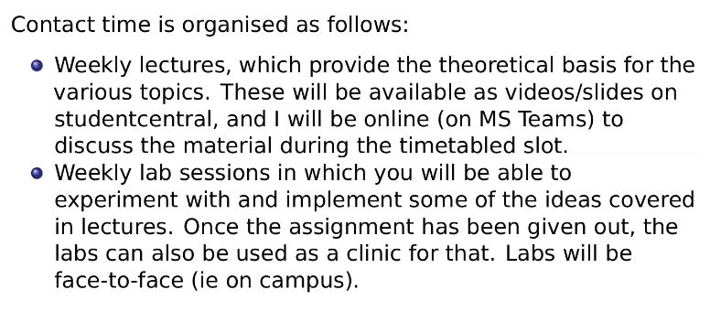

Weekly lecture on Monday at 10am-12am.

Lab session on Thursday at 3pm-4pm. Also time for assignment and questions face
to face.

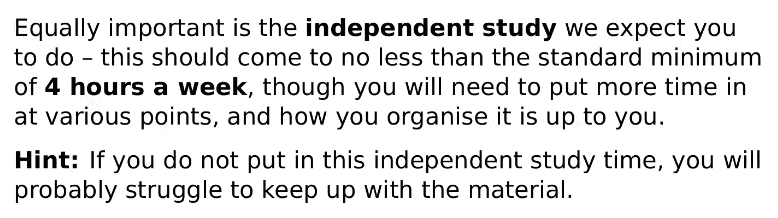

Independent study is important: at least 4 hours a week. Organisation is
self-directed, and without it you will likely fall behind.

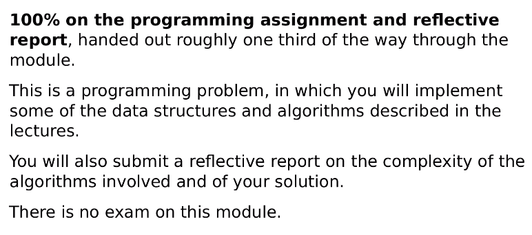

Assessment is 100% based on coursework.

## Overview

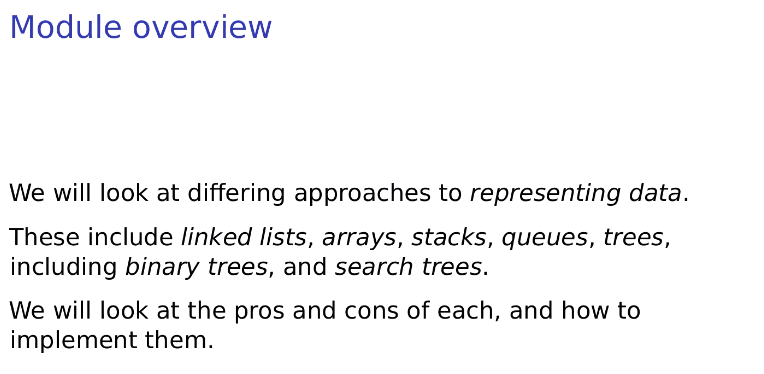

Data Structure Types:
- Linked Lists
- Arrays
- Stacks
- Queues
- Trees
  - Binary Trees
  - Search Trees

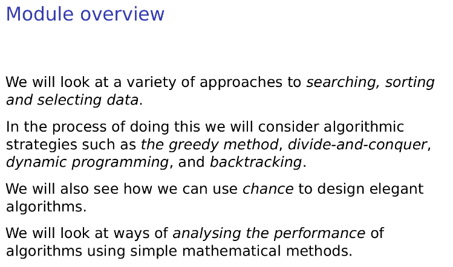

Searches, sorting, and selecting are most important - Lots of complexity in
programs comes from these three things with various data structures.

i.e. Binary search is much less complex in Big-O notation than linear search.

Chance can be exponentially complex, but it can also be very useful for elegant algorithms.

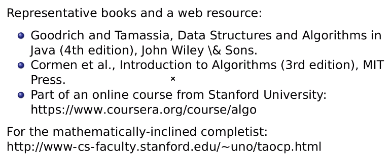
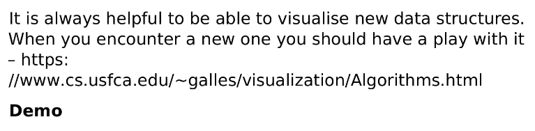

Resources above

<https://coursera.org/course/algo>
<https://www-cs-faculty.stanford.edu/~uno/taocp.html>

For data structure visualisations:
<https://www.cs.usfca.edu/~galles/visualization/Algorithms.html>

## Implementation

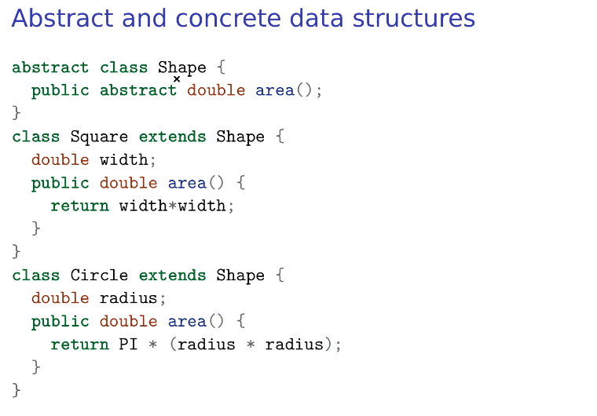

`abstract` in Java means `static`; used for other classes to inherit/extend the
original class. Anything that extends `Shape` has a method `area()` by default,
requiring each inherited class to define it's own method.

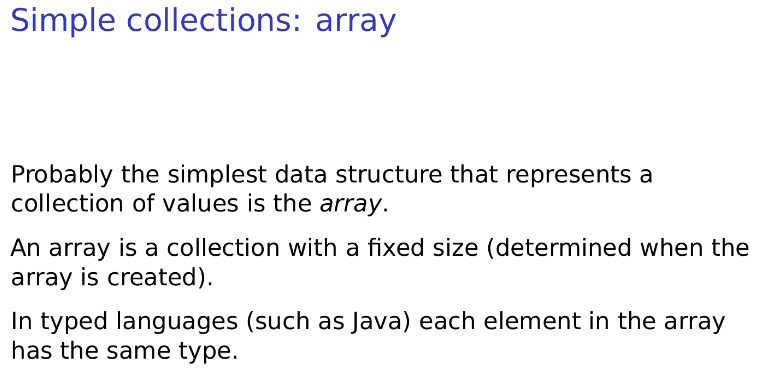

Arrays have a fixed size, and, depending on the language, must be of the same
type. This differs from tuples and lists. Arrays allow access using an index,
starting at 0 (in most languages). Think of an array like a series of letter
boxes.

**snip** basic stuff... See [Further Reading](#further-reading)

## Calculating Complexity

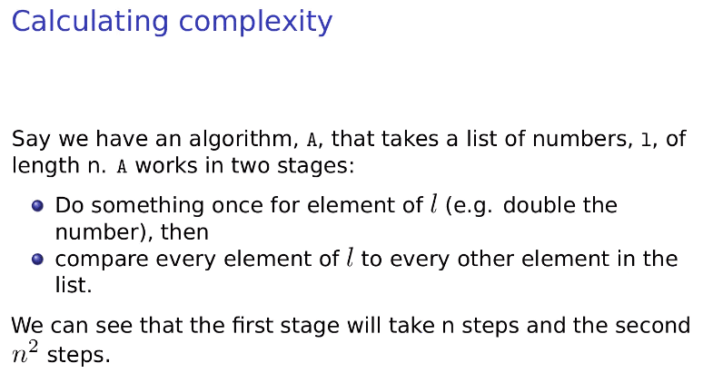

You always take the worst-case complexity for determining Big-O notation: in
this example, it'd be O(n^2) complexity.

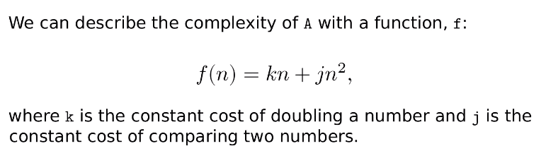

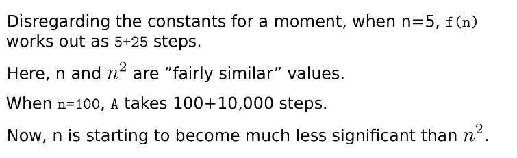

Not too sure where he's going with this...

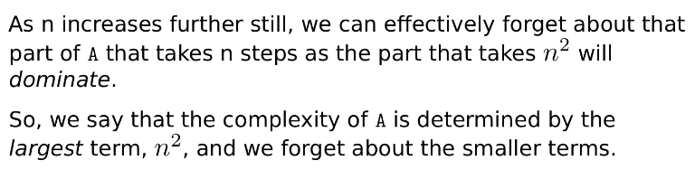

Oh okay. Not sure why this needed a bigger explanation.

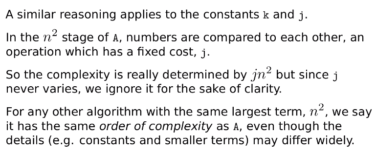

Standard practise is to strip the constants as they don't provide any
information.

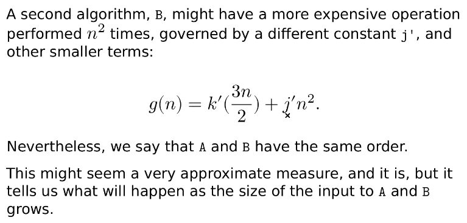

This shows that functions `A` and `B` have identical complexities, even if they
have different constants; both algorithms are O(n^2).

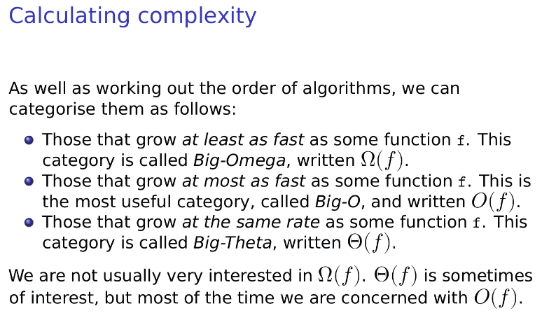

Big-O notation (at most as fast as), Big-Omega notation (at least as fast as),
Big-Theta notation (at the same rate)

- Ω(f) - Best case
- O(f) - Worst case
- Θ(f) - Same case

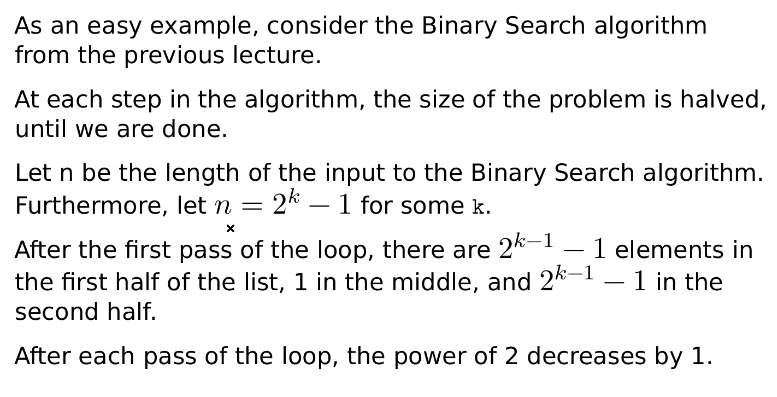

`let n=2^k - 1` for some `k`

After each loop, the power of 2 decreases by 1.

Therefore: the complexity is O(lg(n)), which is equivalent to O(log(n)).

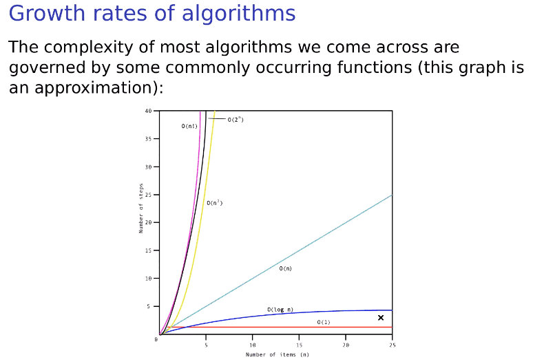

Exponential growth is (generally) **BAD** for performance and scalability.

- Fixed time is great
- Logarithmic time is good
- Linear time is ok!
- Log linear time O(n log n) is pretty alright
- Quadratic time O(n^2) is bad
- Exponential time O(2^n) is **BAD**
- Factorial time O(n!) is **terrible** and is not good for performance at all. Avoid.

## Further Reading

Read about:
- Data Structure Types
  - Array
    - Hash table
  - Stack
  - Queue
  - Linked List
  - Graph
  - Tree
- Big O Notation
  - Time complexity
  - Data complexity
  - Big Theta
  - Big Omega
  - Mathematical operations
    - Logarithms
      - Natural Logs
    - Factorials
    - Floor/Ceil operations
    - Summations
