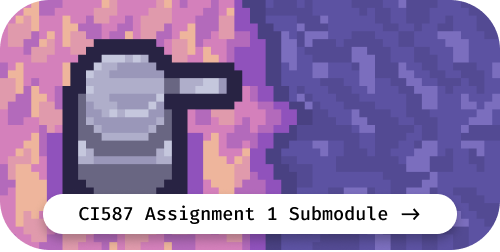
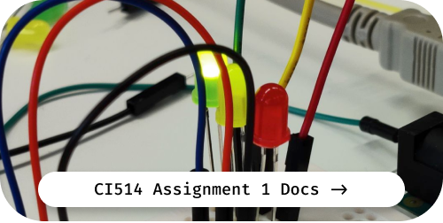

<!-- PROJECT LOGO -->
<br />
<p align="center">
  <a href="https://github.com/lilykiwi/y2-csg-uni">
    
  </a>

  <h2 align="center">y2-csg-uni</h2>

  <p align="center">
    Computer Science for Games · Year 2
    <br />
    <a href="https://github.com/lilykiwi/y1-csg-uni"><strong>Link to Previous Year</strong></a> • <a href="https://lilykiwi.github.io/y2-csg-uni"><strong>Explore the docs »</strong></a>
  </p>
</p>
<br />

<p align="center">
  <a href="https://github.com/lilykiwi/y2-csg-uni-587-a1">
  
  </a><a href="https://lilykiwi.github.io/y2-csg-uni/514-a1">
  
  </a>
</p>

<!-- https://github.com/lilykiwi/y2-csg-uni-583-a1 -->

<!-- TABLE OF CONTENTS -->
<details open="open">
  <summary><h2 style="display: inline-block">Table of Contents</h2></summary>
  <ol>
    <li><a href="#about-the-project">About The Project</a></li>
    <li><a href="#usage">Usage</a></li>
    <li><a href="#contributing">Contributing</a></li>
    <li><a href="#license">License</a></li>
    <li><a href="#contact">Contact</a></li>
  </ol>
</details>

<!-- ABOUT THE PROJECT -->

## About The Project

<!-- [![Product Name Screen Shot][product-screenshot]](https://example.com) -->

This is the second year of my Computer Science for Games repository, being
conducted at the University of Brighton in England. Most of the included
material is currently in a messy state, and I will be intending to fix it up and
present everything in the docs provided above by the end of the course.

The module codes for this course follow the template CI5XX, where CI is the the
module type, 5 is the level, and the last two numbers are the specific module
code. Additionally, each module has two assignments, one in the first semester,
and one in the second. The pass mark is 40% and my personal target is 70%.

| Key                  | Module Name                                | S1 Grade               | S2 Grade               |
| :------------------- | :----------------------------------------- | :--------------------- | :--------------------- |
| :art: CI474          | Introduction to 3D Modelling and Animation |                        |                        |
| :factory: CI514      | Embedded Systems                           |                        |                        |
| :toolbox: CI517      | Game Engine Fundamentals                   | :free: (no assignment) |                        |
| :technologist: CI536 | Integrated Group Project                   | :free: (no assignment) |                        |
| :hammer: CI541       | Game Development Frameworks                |                        |                        |
| :penguin: CI583      | Data Structures and Operating Systems      |                        | :free: (no assignment) |
| :joystick: CI587     | Web Based Game Development                 |                        | :free: (no assignment) |

### Briefs

#### Assignment 1

- [474-introduction-to-3d-modelling-and-animation/briefs/CI474-Assignment-1.md](474-introduction-to-3d-modelling-and-animation/briefs/CI474-Assignment-1.md)
- [514-embedded-systems/briefs/CI514-Assignment-1.md](514-embedded-systems/briefs/CI514-Assignment-1.md)
- [541-game-development-frameworks/briefs/CI541-Assignment-1.md](541-game-development-frameworks/briefs/CI541-Assignment-1.md)
- [583-data-structures-and-operating-systems/briefs/CI583-Assignment-1.md](583-data-structures-and-operating-systems/briefs/CI583-Assignment-1.md)
- [587-web-based-game-development/briefs/CI587-Assignment-1.md](587-web-based-game-development/briefs/CI587-Assignment-1.md)

<!-- USAGE EXAMPLES -->

<!--## Usage-->

<!--Nothing yet!-->

<!-- CONTRIBUTING -->

## Contributing

This repository follows [conventional commit guidelines](https://www.conventionalcommits.org/en/v1.0.0/). Custom types (with emoji) are added for various types of commit.

```plaintext
lab: :test_tube: finished the lab work for 2020-10-25
```

| Icon            | Shortcode         | Description |
| :-------------- | :---------------- | :---------- |
| :bookmark_tabs: | `:bookmark_tabs:` | Lecture     |
| :test_tube:     | `:test_tube:`     | Lab         |
| :ledger:        | `:ledger:`        | Seminar     |


## License

Distributed under the MIT License. See `LICENSE.md` for more information.

<!-- CONTACT -->

## Contact

Lily Hayes - [@lilykiwi\_](https://twitter.com/lilykiwi_) - lilykiwi9911@pm.me

Project Link: [https://github.com/lilykiwi/y2-csg-uni](https://github.com/lilykiwi/y2-csg-uni)
